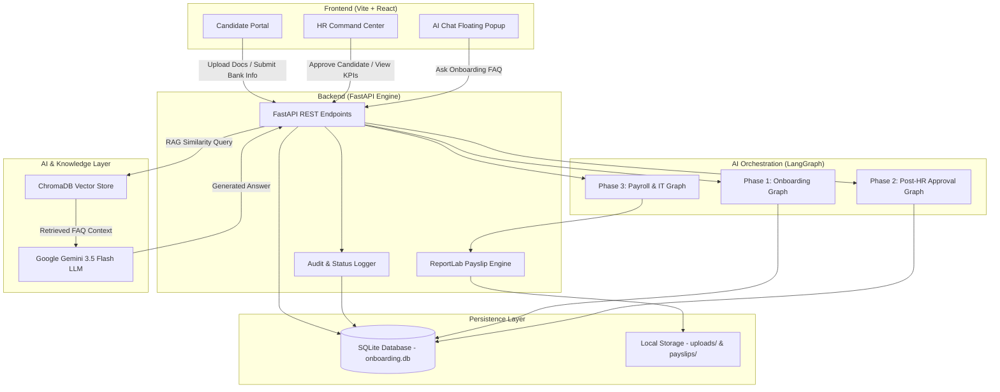
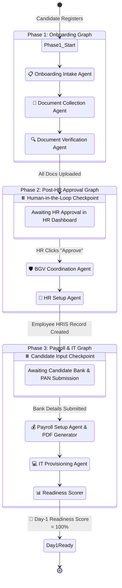
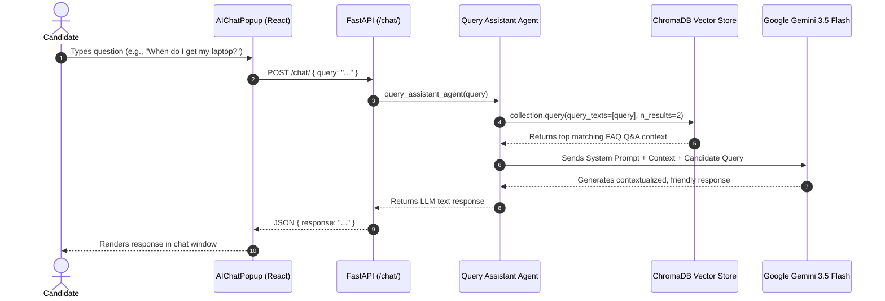
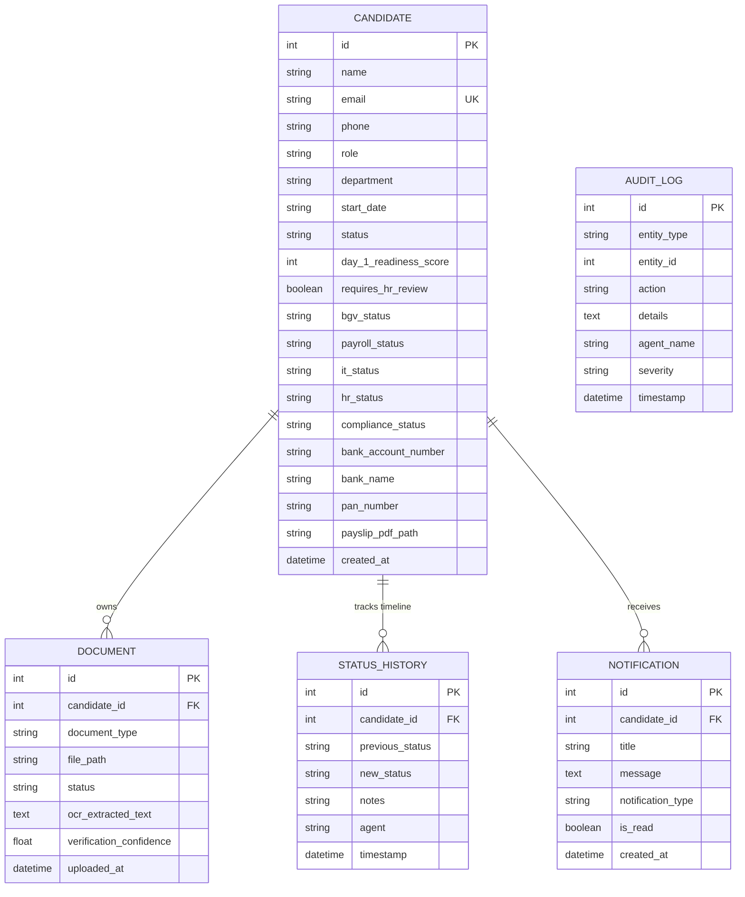

# 🚀 NextGen NextStep — AI-Powered Onboarding Control Tower

**NextGen NextStep** is an enterprise-grade, AI-powered Onboarding Control Tower designed to streamline new hire onboarding, eliminate manual cross-department coordination, automate document verification and payroll setup, and provide real-time visibility for candidates and HR teams alike.

---

## 📌 Table of Contents
1. [System Overview](#-system-overview)
2. [High-Level Architecture](#-high-level-architecture)
3. [AI Agents & LangGraph Workflow](#-ai-agents--langgraph-workflow)
   - [Agent Roles & Responsibilities](#agent-roles--responsibilities)
   - [Multi-Phase Orchestration Graph](#multi-phase-orchestration-graph)
   - [RAG Query Assistant Chatbot](#rag-query-assistant-chatbot)
4. [Database & Data Models](#-database--data-models)
5. [Key Prototype Features](#-key-prototype-features)
6. [Tech Stack](#-tech-stack)
7. [Project Structure](#-project-structure)
8. [Setup & Installation Guide](#-setup--installation-guide)
9. [API Endpoints Reference](#-api-endpoints-reference)

---

## 🌟 System Overview

Traditional employee onboarding suffers from fragmented processes across multiple teams (HR, IT, Finance, BGV vendors), manual document verification delays, lack of candidate visibility, and audit gaps.

**NextGen NextStep** unifies these disparate workflows into an **AI Orchestration Layer** powered by **LangGraph** and **Google Gemini 3.5 Flash**, supported by an interactive **Candidate Portal** and a centralized **HR Command Center**.

```
                           +-------------------------------------+
                           |      NextGen NextStep Platform      |
                           +-------------------------------------+
                                              |
               +------------------------------+------------------------------+
               |                                                             |
+------------------------------+                              +------------------------------+
|       Candidate Portal       |                              |     HR Command Center UI     |
| - Onboarding Journey         |                              | - Real-time Pipeline Metrics |
| - Doc Upload & Status        |                              | - Exception Routing Queue    |
| - Bank/PAN Payroll Input     |                              | - Human-in-the-Loop Approval |
| - Gemini AI FAQ Assistant    |                              | - Compliance Audit Log       |
+------------------------------+                              +------------------------------+
               |                                                             |
               +------------------------------+------------------------------+
                                              |
                                              v
                           +-------------------------------------+
                           |        FastAPI Backend Service      |
                           +-------------------------------------+
                                              |
     +-------------------------+--------------+--------------+-------------------------+
     |                         |                             |                         |
     v                         v                             v                         v
+----------+          +-----------------+           +------------------+     +-------------------+
|  SQLite  |          |    LangGraph    |           |    ChromaDB &    |     | ReportLab Payslip |
| Database |          | Agent Workflows |           | Gemini 3.5 Flash |     |   PDF Generator   |
+----------+          +-----------------+           +------------------+     +-------------------+
```

---

## 🏗️ High-Level Architecture

The system follows a modern decoupled architecture:



---

## 🤖 AI Agents & LangGraph Workflow

The core intelligence is driven by a multi-agent framework built with **LangGraph**. To accommodate asynchronous candidate tasks and Human-in-the-Loop (HITL) HR interventions, the agent graph is split into **three distinct execution phases**.

### Agent Roles & Responsibilities

| Agent Name | Function & Logic | Status Impact |
|---|---|---|
| 📋 **Onboarding Intake Agent** | Determines role-based required documents (`ID`, `Degree`, `Offer Letter`), sets initial readiness score = 10%, and pushes welcome notifications. | Stage set to `Intake` |
| 📁 **Document Collection Agent** | Validates uploaded documents against requirements. Calculates document score (+7 pts per uploaded document). | Stage set to `doc_collection` |
| 🔍 **Document Verification Agent** | Evaluates document authenticity and confidence score. Upon receiving all required docs, transitions candidate to HR review (+10 pts). | Stage set to `pending_hr_approval` |
| 🛡️ **BGV Coordination Agent** | Initiates background check. Checks for compliance exceptions/flagged reviews (+20 pts upon clearing). | BGV status set to `cleared` or `flagged` |
| 👤 **HR Setup Agent** | Provisions employee record in HRIS (+15 pts) and prompts candidate for bank details. | Stage set to `payroll_setup` |
| 💰 **Payroll Setup Agent** | Consumes bank details & PAN, calculates CTC breakdown (fixed ₹9,00,000 CTC), and builds downloadable PDF payslip (+12 pts). | Payroll status set to `completed` |
| 💻 **IT Provisioning Agent** | Simulates hardware asset allocation, corporate email generation, and tool access provisioning. | IT status set to `completed` |
| 📊 **Readiness Scorer** | Aggregates overall onboarding status, calculates final Day-1 Readiness Score (100%), and notifies candidate. | Stage set to `ready` |
| 🤖 **Query Assistant Agent** | RAG-based AI assistant using ChromaDB embeddings + Gemini 3.5 Flash for answering candidate questions 24/7. | Standalone chat service |

---

### Multi-Phase Orchestration Graph

The sequence diagram below demonstrates how state passes between agent nodes and where human/candidate checkpoints pause execution:



#### Detailed Phase Descriptions:

1. **Phase 1 (`onboarding_graph`)**: Executed on initial candidate creation and subsequent document uploads ([graph.py](file:///c:/NextGen%20NextStep/backend/agents/graph.py#L6-L19)).
   - Evaluates missing documents: `["ID", "Degree", "Offer Letter"]`.
   - Once all 3 documents are present, transitions candidate status to `pending_hr_approval` and halts.

2. **Phase 2 (`post_approval_graph`)**: Triggered when HR approves the candidate via `POST /candidates/{id}/approve` ([graph.py](file:///c:/NextGen%20NextStep/backend/agents/graph.py#L21-L33)).
   - Clears background verification (BGV).
   - Generates HRIS employee record and updates stage to `payroll_setup`, prompting the candidate for bank account & PAN details.

3. **Phase 3 (`payroll_graph`)**: Triggered when candidate submits bank details via `POST /candidates/{id}/bank-details` ([graph.py](file:///c:/NextGen%20NextStep/backend/agents/graph.py#L35-L48)).
   - Configures payroll, computes annual salary components, and compiles `payslip_{id}.pdf` via ReportLab.
   - Executes IT provisioning for hardware/software credentials.
   - Runs `readiness_scorer` to push Day-1 Readiness to **100%**.

---

### RAG Query Assistant Chatbot

Candidate questions asked through the floating AI widget in the portal are processed using Retrieval-Augmented Generation (RAG):



---

## 🗄️ Database & Data Models

The backend utilizes SQLAlchemy ORM with SQLite (`onboarding.db`).



---

## ✨ Key Prototype Features

1. **Candidate Onboarding Portal**:
   - Dynamic SVG Day-1 Readiness Gauge (0-100%).
   - Drag-and-drop document uploader with missing document badges.
   - Interactive onboarding timeline tracking stage progression.
   - Built-in bank details submission form and instant PDF payslip download.

2. **HR Command Center**:
   - Operational KPI dashboard (Total Candidates, Readiness Rate, Docs Verified, Flagged Issues).
   - Candidate pipeline table with real-time status & progress bars.
   - One-click HR Approval button to advance candidates past verification.
   - Exception routing tab for flagged BGV or document reviews.
   - Filterable Audit Log tab for complete regulatory compliance tracking.

3. **AI Onboarding Assistant**:
   - 24/7 floating chat widget pre-seeded with FAQs ([faq.json](file:///c:/NextGen%20NextStep/backend/faq.json)).
   - Semantic vector search using ChromaDB + Google Gemini LLM fallback.

---

## 🛠️ Tech Stack

* **Backend Framework**: Python 3.10+, FastAPI, Uvicorn
* **Agent Framework**: LangGraph, LangChain core state graphs
* **LLM & Embeddings**: Google GenAI SDK (`google-genai`), Gemini 3.5 Flash, ChromaDB (`sentence-transformers`)
* **Document Processing & PDF Generation**: ReportLab, PyPDF2 / pdfplumber
* **Database & ORM**: SQLite 3, SQLAlchemy
* **Frontend UI**: React 18, Vite, JavaScript (ES6+), Vanilla CSS3 (Custom Design System with glassmorphism & gradients)

---

## 📂 Project Structure

```
NextGen NextStep/
├── backend/
│   ├── agents/
│   │   ├── __init__.py
│   │   ├── state.py                # AgentState schema definition
│   │   ├── nodes.py                # Core agent nodes (Intake, Collection, BGV, HR, Payroll, IT)
│   │   ├── doc_verification.py     # Document verification agent node
│   │   ├── graph.py                # LangGraph 3-phase workflows
│   │   └── query_assistant.py      # Gemini + ChromaDB RAG FAQ chatbot
│   ├── database/
│   │   ├── database.py             # SQLAlchemy session & DB initialization
│   │   └── models.py               # ORM tables (Candidate, Document, AuditLog, etc.)
│   ├── services/
│   │   ├── vector_store.py         # ChromaDB persistence & FAQ seeding logic
│   │   └── payslip_generator.py    # ReportLab PDF payslip generator
│   ├── uploads/                    # Stored uploaded candidate documents & payslips
│   ├── faq.json                    # Seed FAQ knowledge base
│   ├── main.py                     # FastAPI routes & business logic
│   └── requirements.txt            # Python dependencies
├── frontend/
│   ├── src/
│   │   ├── components/
│   │   │   ├── CandidatePortal/    # Candidate portal view & forms
│   │   │   ├── HRDashboard/        # HR command center & KPI views
│   │   │   ├── AIChatPopup.jsx     # Floating AI chat widget
│   │   │   └── Login.jsx           # Role selection & login component
│   │   ├── api.js                  # Axios REST API client
│   │   ├── App.jsx                 # Main React container
│   │   └── App.css                 # Custom CSS Design System
│   ├── package.json
│   └── vite.config.js
├── onboarding.db                   # SQLite database instance
├── .env.example                    # Environment variable template
└── README.md                       # Project documentation
```

---

## ⚙️ Setup & Installation Guide

### Prerequisites
- Python 3.10 or higher
- Node.js 18.x or higher & npm
- Gemini API Key (obtained from Google AI Studio)

### 1. Environment Configuration
Copy `.env.example` to `.env` in the root directory:
```bash
GEMINI_API_KEY=your_actual_gemini_api_key_here
```

### 2. Backend Setup
```bash
# Navigate to root directory
cd "c:\NextGen NextStep"

# Activate Python virtual environment (Windows)
.\venv\Scripts\activate

# Install dependencies
pip install -r backend/requirements.txt

# Start FastAPI server
uvicorn backend.main:app --reload --port 8000
```
*The FastAPI backend will run on `http://localhost:8000` (Interactive API docs at `http://localhost:8000/docs`).*

### 3. Frontend Setup
Open a new terminal window:
```bash
# Navigate to frontend folder
cd "c:\NextGen NextStep\frontend"

# Install node dependencies
npm install

# Start Vite development server
npm run dev
```
*The React frontend will run on `http://localhost:5173`.*

---

## 🔌 API Endpoints Reference

### Candidate Endpoints
* `POST /candidates/`: Create a new candidate & initiate Phase 1 intake agent graph.
* `GET /candidates/`: List all candidates (for HR Dashboard).
* `GET /candidates/{id}`: Get candidate details and uploaded documents.
* `GET /candidates/by-email/{email}`: Retrieve candidate profile by email.

### Document & Progress Endpoints
* `POST /candidates/{id}/documents/`: Upload a candidate document & trigger verification graph.
* `POST /candidates/{id}/approve`: **HR Action** — Approve candidate to launch Phase 2 (BGV & HR Setup).
* `POST /candidates/{id}/bank-details`: **Candidate Action** — Submit bank/PAN details to launch Phase 3 (Payroll, IT & Payslip PDF).
* `GET /candidates/{id}/payslip`: Download generated PDF payslip.

### Analytics & AI Endpoints
* `POST /chat/`: Submit a question to the Gemini RAG AI Assistant.
* `GET /metrics/`: Fetch aggregated KPI success metrics for HR Dashboard.
* `GET /audit-logs/`: Fetch system and agent audit logs for compliance tracking.
* `GET /candidates/{id}/timeline`: Fetch status history timeline for a candidate.
